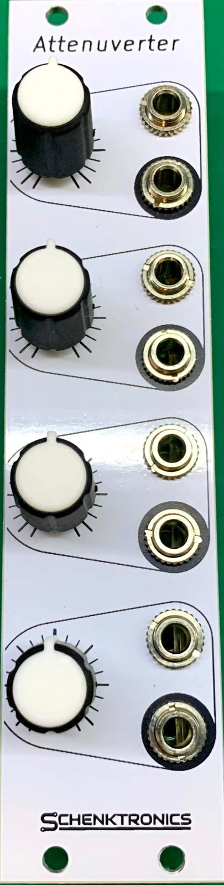

<picture>
  <source media="(prefers-color-scheme: dark)" srcset="docs/images/logo-light.png">
  
</picture>

# Attenuverter

A 6HP Eurorack quad attenuverter from **Schenktronics**. Each of its four channels scales a signal by anywhere from ×1, through zero, to ×−1 (inverted), with a click at zero. Every input is normalled to +5 V, so with nothing plugged in, each channel is a manual offset from −5 V to +5 V.



## Features

- 6HP Eurorack, 20 mm deep. 16 mA on +12 V and 9 mA on −12 V.
- Four channels, each turning a signal down, off, or upside down
- Center-detent knobs, so zero is easy to find by feel
- Inputs normalled to +5 V: four manual offset voltages when nothing's plugged in
- Reverse-power protection on both rails

## Documentation

| Document | For | PDF |
|----------|-----|-----|
| [User Manual](docs/manual.md) | Using the module | [PDF](docs/pdf/attenuverter-manual.pdf) |
| [Assembly Guide](docs/assembly-guide.md) | Building the kit | [PDF](docs/pdf/attenuverter-assembly-guide.pdf) |
| [Bill of Materials](docs/BOM.md) ([CSV](docs/BOM.csv)) | Parts and sourcing | |

## Repository layout

```
Attenuverter/                 Main PCB (KiCad 5.1)
  Attenuverter.sch              Schematic
  Attenuverter.kicad_pcb        PCB layout
  Attenuverter.step             3D model
  Gerbers/, *Gerbers.zip        Fabrication files
  attenuverter BOM.xlsx         Original BOM spreadsheet
AttenuverterFaceplate/        Faceplate (KiCad 5.1, made as an aluminium PCB)
  *.dxf                         Panel outline and drill drawing
  *Gerbers/, *Gerbers.zip       Fabrication files
docs/                         Manual, assembly guide, BOM, images
  drawings/                     Scripts that generate the drawings
  pdf/                          PDF versions and their build settings
```

## Fabrication

| Board | Size | Layers | Thickness | Notes |
|-------|------|--------|-----------|-------|
| Main PCB | 30 × 100 mm | 2 | 1.6 mm | Standard green is fine |
| Faceplate | 30 × 128.5 mm | 1 | 1.6 mm | Aluminium PCB, white solder mask, black silkscreen. Only the front copper layer is used, so FR4 works too. |

Upload the matching `*Gerbers.zip` to any common PCB fab.

## License

This hardware design and its documentation are licensed under [CC BY-NC-SA 4.0](https://creativecommons.org/licenses/by-nc-sa/4.0/). See [LICENSE](LICENSE).

The Schenktronics name and logo are trademarks of Nathan Schenk and are not covered by the CC BY-NC-SA 4.0 license.

## Links

- Tindie: <https://www.tindie.com/products/schenktronics/attenuverter/>
- ModularGrid: <https://modulargrid.net/e/schenktronics-attenuverter>
- Build video: <https://www.youtube.com/watch?v=QJxtZVHBpq0>
- Website: <https://schenktronics.com>
