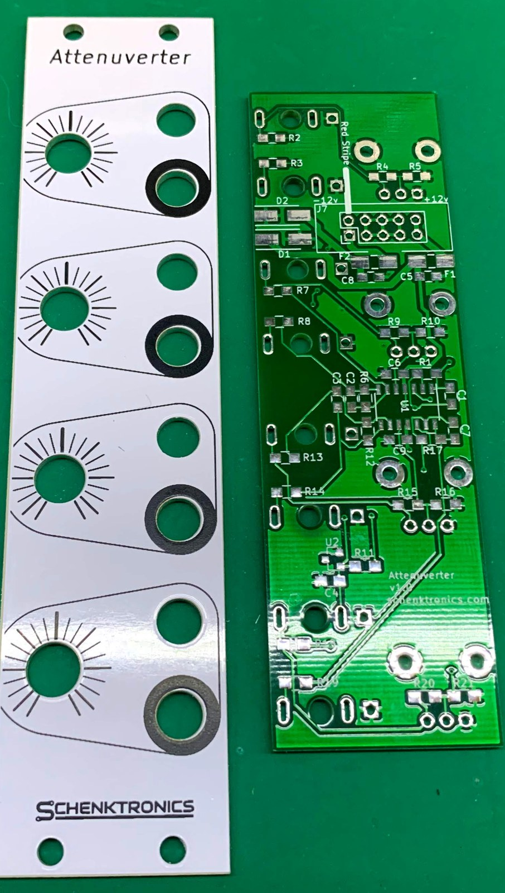
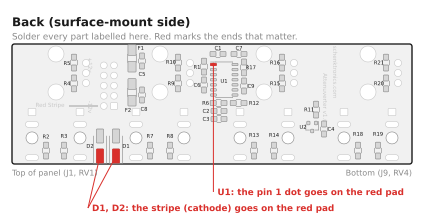
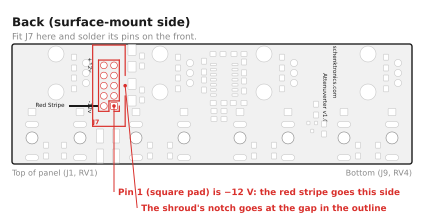
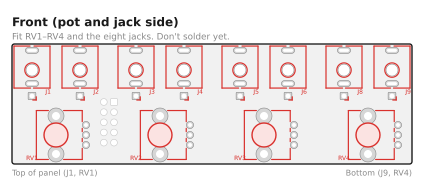
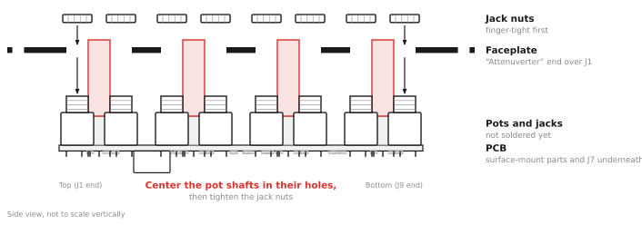
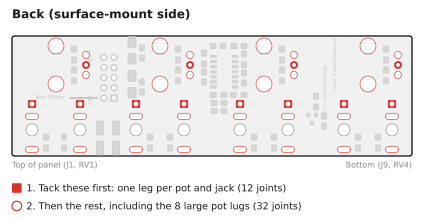
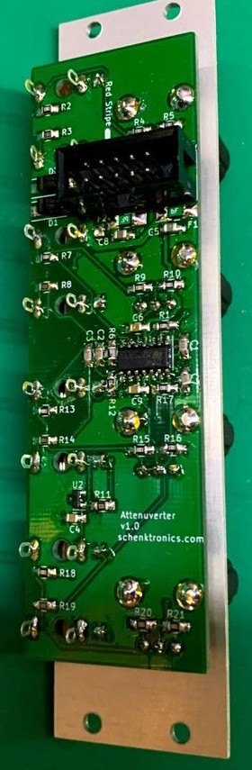

# Attenuverter — Assembly Guide

This kit has 139 solder joints, 85 of them on surface-mount parts: 0805 resistors and capacitors, and a SOIC-14 chip. It takes about 1½–2 hours if you're experienced with surface-mount soldering, and longer if you're not. If you haven't soldered surface-mount parts before, practice on a scrap board first, or start with a through-hole kit such as the [Passive Attenuator](https://github.com/schenkzoola/Attenuator).

**Prefer to watch?** There's a video of the whole build: [Watch me build a surface mount attenuverter!](https://www.youtube.com/watch?v=QJxtZVHBpq0)

## What you need

### Kit contents

Check your kit against this list before you start (full details in the [BOM](BOM.md)):

- [ ] 1 × main PCB
- [ ] 1 × faceplate
- [ ] 1 × TL074 quad op-amp (U1, 14 pins)
- [ ] 1 × LM4040 5 V reference (U2, 3 pins)
- [ ] 16 × 100 kΩ resistors
- [ ] 4 × 100 Ω resistors
- [ ] 1 × 1 kΩ resistor
- [ ] 4 × 10 pF capacitors
- [ ] 3 × 100 nF capacitors
- [ ] 2 × 10 µF capacitors
- [ ] 2 × diodes (D1, D2)
- [ ] 2 × resettable fuses (F1, F2)
- [ ] 1 × 10-pin shrouded power header
- [ ] 8 × 3.5 mm jacks with nuts
- [ ] 4 × potentiometers
- [ ] 4 × knobs
- [ ] 1 × power cable, 10-pin to 16-pin

The capacitors have no markings, so the three values look alike, and resistor markings vary between makers. Keep each value in its labelled strip or bag until you place it.

### Tools

- Soldering iron with a fine tip (about 330–360 °C for leaded solder)
- Thin solder, 0.5 mm or less
- Fine tweezers
- Flux (a pen or syringe) and solder wick, for fixing bridges
- A magnifier or loupe, to inspect the surface-mount joints
- Flush cutters
- Multimeter with continuity (beep), diode test and DC voltage modes
- Nut driver or wrench for the jack nuts (optional, but it avoids scratching the panel)

## Before you start

- The board has two sides. The **back** has the small rectangular pads for the surface-mount parts, and is printed "Attenuverter v1.0 / schenktronics.com" and "Red Stripe". The **front** has the outlines for the pots and jacks (RV1–RV4, J1–J9).
- Build in this order: surface-mount parts, then the power header, then the pots and jacks. Each stage is easier while the next one isn't in the way.
- **Don't solder the pots or jacks until the faceplate is fitted.** The faceplate holds them in line while you solder.

## Step 1 — Solder the surface-mount parts

All of these go on the back of the board. For every two-pad part, use the same method:

1. Put a little solder on one pad.
2. Hold the part with tweezers, slide it onto the pads, and reheat the tinned pad so the part settles flat.
3. Solder the other pad, then go back and touch up the first one.

Work in this order, from the most difficult part to the easiest:

1. **U1 (TL074).** Line up the dot or notch on the chip with the pin 1 pad, marked red in the drawing. Tack one corner pin, check that all 14 pins sit on their pads, then tack the opposite corner. Solder the rest. If two pins bridge, add flux and clean the bridge with wick.
2. **U2 (LM4040).** It only fits one way round: two pins on one side, one on the other.
3. **Resistors**, one value at a time:

   | Value | Where |
   |-------|-------|
   | 100 kΩ (16) | R1, R2, R4, R5, R6, R7, R9, R10, R12, R13, R15, R16, R17, R18, R20, R21 |
   | 100 Ω (4) | R3, R8, R14, R19 |
   | 1 kΩ (1) | R11 |

4. **Capacitors**, one value at a time. Open one strip at a time so you don't mix them up.

   | Value | Where |
   |-------|-------|
   | 10 pF (4) | C1, C2, C3, C7 |
   | 100 nF (3) | C4, C6, C9 |
   | 10 µF (2) | C5, C8 |

5. **D1 and D2.** The stripe (cathode) end goes on the red pad in the drawing: the end of the outline with the line across it. These diodes protect the module if the power cable goes in backwards, so a reversed diode shorts the power rail.
6. **F1 and F2**, the resettable fuses. They work either way round.

Check every joint with a magnifier. Each one should be a smooth fillet from the pad up the end of the part, with no bridges between U1's pins.

## Step 2 — Fit the power header

1. Push J7 into its holes from the **back**. Turn it so the notch in the shroud lines up with the gap in the printed outline. Pin 1 (the square pad) is −12 V, next to the "Red Stripe" marking.
2. Turn the board over and solder one pin on the front. Check that the header sits flat against the board; if not, reheat the pin and press it down.
3. Solder the other nine pins.

## Step 3 — Check for shorts

Before adding the rest, check the power rails with a multimeter in diode test mode (the diode symbol). No power is needed. Probe the header pins from the front of the board.

Use diode test mode, not resistance mode. Most meters test resistance at too low a voltage to turn a diode on, so a diode fitted backwards reads as an open circuit in resistance mode and looks fine. Diode test mode uses a higher voltage and shows a diode's forward voltage instead.

| Test | Expected result |
|------|-----------------|
| Red probe on pin 9 (+12 V), black on pin 3 (ground) | OL, or a high reading. It may count up for a moment while the capacitors charge. |
| Red probe on pin 3 (ground), black on pin 1 (−12 V) | OL, or a high reading. It may count up for a moment. |
| Red probe on pin 3 (ground), black on pin 9 (+12 V) | About 0.5–0.7 V: D1 conducting. |
| Red probe on pin 1 (−12 V), black on pin 3 (ground) | About 0.5–0.7 V: D2 conducting. |

What a wrong reading means:

- **Near 0 V** (many meters also beep) in any test: a short. Look for a solder bridge on U1 or on the power header.
- **About 0.5–0.7 V in the first or second test:** D1 (first test) or D2 (second test) is fitted backwards. Fitted like that, it would short the rail as soon as you power on.
- **OL in the third or fourth test:** D1 or D2 is missing, fitted backwards, or not soldered.

## Step 4 — Fit the pots and jacks

1. Push the four pots into RV1–RV4 from the **front** of the PCB. Each pot fits only one way round: the three pins go in the row of three small holes and the two mounting lugs go in the large holes. The lugs clip into the board and hold the pot in place.
2. Insert the eight jacks into J1–J6, J8 and J9 from the front. Make sure each jack sits flat, with all three legs through their pads.
3. Don't solder anything yet.

## Step 5 — Fit the faceplate

1. Remove the nuts from the jacks. The pots have no nuts.
2. Lower the faceplate over the parts. The "Attenuverter" label goes at the top, over J1 and RV1. The pot shafts go through the four larger holes.
3. Put the jack nuts back on and tighten them **finger-tight** for now.
4. Check that each pot shaft is centered in its hole, and that the PCB is parallel to the faceplate. The shafts are thinner than their holes, and nothing but the solder will hold them, so centering them now stops the knobs rubbing later. The legs have a little play in their holes, which gives you room to adjust.
5. Tighten the jack nuts snugly. Do not overtighten them, because that can crack the jack threads or mark the panel.

## Step 6 — Solder the pots and jacks

Turn the assembly over and solder from the back of the PCB, between the surface-mount parts.

1. Tack one leg of each part: the square pad of each jack and the middle pin of each pot. Then check again that the pot shafts are still centered. If one isn't, reheat that joint and adjust.
2. Solder the remaining pins and pads.
3. Solder the eight large mounting-lug pads of the pots. They connect to ground, so they take a little longer to heat. Hold the iron on until the solder flows into the hole.
4. Trim any long leads with flush cutters.

> **Building with CUI MJ-3507 jacks** (the ones in the Mouser parts list)? Their tip and switch pins go into the board, but the sleeve is a solder lug on the jack, not a pin. Tack the tip pin instead of the square pad, then solder a short wire from each jack's sleeve lug to its square pad. Without the wire, the jack has no ground.

## Step 7 — Fit the knobs

Push each knob onto its pot shaft. The flat on the shaft sets the knob's position. Turn each knob to its center click and check that the pointer points straight up, at the long mark on the panel. Check that each knob turns without rubbing on the panel.

## Step 8 — Test

### Without power

Repeat the Step 3 short test on the header pins. Then plug a patch cable into each jack in turn and check its sleeve against a ground pin (pins 3–8) on the header: every jack should beep.

### With power

Connect the module to your case (see [Install](#step-9--install)), with the red stripe on −12 V at both ends, and power on. If anything gets hot or smells, power off at once and check the diodes and U1.

With nothing plugged into the inputs, measure each output with the multimeter on DC volts. Plug a patch cable into the output and probe its tip and sleeve.

| Knob | Expected output |
|------|-----------------|
| Fully clockwise | About +5 V |
| Center click | About 0 V |
| Fully anticlockwise | About −5 V |

Then patch an LFO or other moving signal into each input in turn, and listen or watch as you turn the knob from one end to the other: the signal should shrink to nothing at the center and grow again, inverted, on the other side.

## Step 9 — Install

Install the module in your case with the included power cable and four M3 rack screws (two will do). The details, and how to use the module, are in the [User Manual](manual.md#installation).

## Troubleshooting

| Symptom | Likely cause |
|---------|--------------|
| Nothing works, and the power supply struggles, a fuse trips or U1 gets hot | A short on a power rail: a solder bridge on U1, U1 fitted the wrong way round (check its pin 1), a diode fitted backwards, or the power cable plugged in backwards. |
| No channel works, but nothing gets hot | The power header isn't soldered well. |
| Empty inputs give 0 V at every knob position | U2 or R11 isn't soldered well, or U2 is missing: the +5 V normal isn't there. |
| One channel is dead | A bad joint on that channel's jacks, pot, or its resistors and capacitor. Check the pins of U1 for that channel too. |
| An output is stuck near +10 V or −10 V | A missing or badly soldered resistor on that channel, so the op-amp has no feedback. Check the 100 kΩ resistors near it. |
| An empty input works, but a plugged-in signal doesn't come through | A bad joint on that input jack's tip leg. |
| A knob works backwards (clockwise inverts) | The pot is a different type from the one in the BOM. |
| The center click isn't at 0 V | A small offset is normal. A large one means a resistor of the wrong value next to that pot: check the two 100 kΩ resistors beside it. |
| A knob rubs on the panel | The shaft isn't centered in its hole, or the knob is pushed on too far. |
