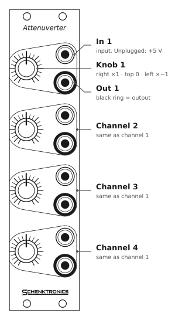
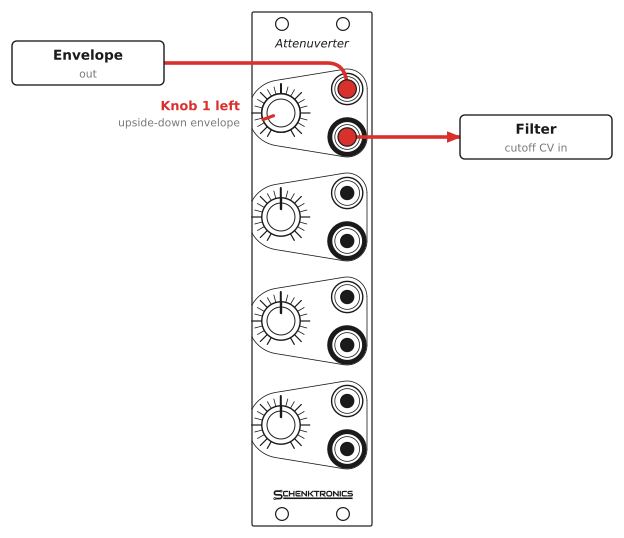
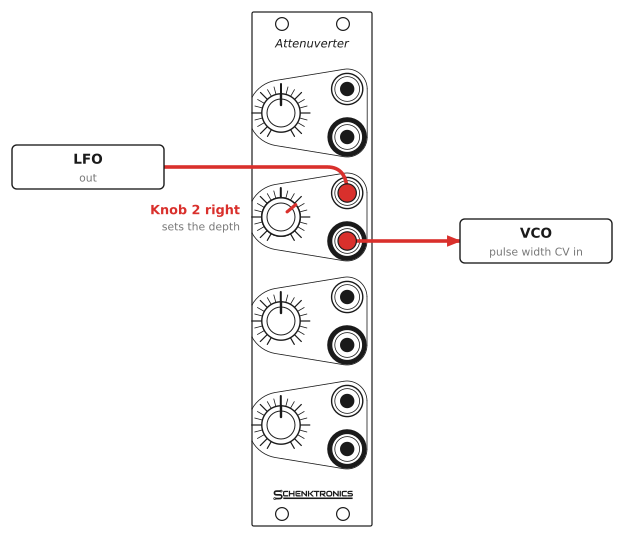
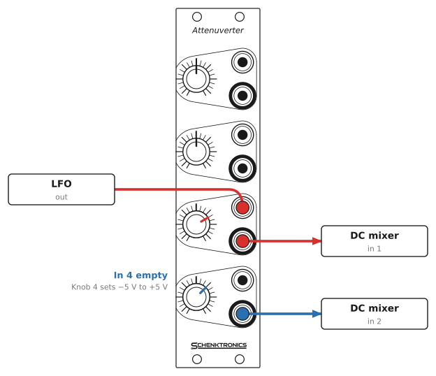

# Attenuverter — User Manual

## Overview

The Attenuverter is a 6HP Eurorack utility module with four identical channels. Each channel scales the signal at its input by an amount set by its knob, anywhere from full level, through zero, to full level upside down (inverted).

Each input is normalled to +5 V. With nothing plugged into an input, its output is a steady voltage from −5 V to +5 V, set by the knob. So each channel is also a manual offset or CV source.

The module is active: it needs ±12 V from your case's power supply.

## Specifications

| | |
|---|---|
| Format | Eurorack, 6HP |
| Panel | 30 × 128.5 mm |
| Depth | 20 mm |
| Power | 16 mA on +12 V, 9 mA on −12 V, no +5 V. 10-pin header. |
| Protection | Reverse-power diodes and resettable fuses on both rails |
| Jacks | 8 × 3.5 mm mono (TS): 4 inputs, 4 outputs |
| Controls | 4 × knobs with a center detent (100 kΩ linear potentiometers) |
| Range | ×−1 (fully anticlockwise) to 0 (center) to ×+1 (fully clockwise) |
| Unplugged inputs | +5 V, so the output is −5 V to +5 V |
| Input impedance | About 33–52 kΩ, depending on the knob (calculated) |
| Output impedance | 100 Ω |
| Signals | Audio, CV, gates and bipolar signals. DC-coupled. |
| Output swing | About ±10 V, limited by the op-amp running on ±12 V |

## Panel layout

The panel has four identical channels, numbered 1 to 4 from the top. Each channel is outlined, with its knob on the left and two jacks on the right. The top jack is the input. The jack with the **black ring** is the output.

## Using the module

### Knobs

Each knob sets how much of the input reaches the output, and which way up:

| Knob position | Output |
|---------------|--------|
| Fully clockwise | The input, unchanged (×1) |
| Halfway between the center and fully clockwise | About a third of the input (×0.36) |
| Center (the click) | Nothing (×0) |
| Halfway between the center and fully anticlockwise | About a third of the input, inverted (×−0.36) |
| Fully anticlockwise | The input, inverted (×−1) |

"Inverted" means turned upside down: a rising envelope falls instead, and a +3 V CV becomes −3 V.

The knob has a click (detent) at the center, where the output is zero. It's easy to find by feel, so it's quick to return a channel to "off".

The knobs are center-weighted. Halfway to either end gives about a third of the signal rather than half, so more of the knob's travel is spent on small amounts. That's where fine control usually matters, for example for a gentle vibrato or a small filter wobble.

### Normalled inputs: offset voltages

Each input is normalled to +5 V. When nothing is plugged into an input, the channel gets +5 V instead. The output is then a steady voltage:

- **Fully clockwise:** +5 V
- **Center:** 0 V
- **Fully anticlockwise:** −5 V

Use this as a manual CV knob for a module that has no knob of its own, to transpose a sequence, or to shift an LFO up or down through a DC mixer. Plugging a cable into the input breaks the normal.

### Using it on audio

On audio, a channel is a volume control that can also flip the phase. Mixing a signal with an inverted copy of itself cancels it out.

## Patch examples

Each drawing shows the module that sends the signal on the left and the modules that receive it on the right.

### Invert an envelope

Turn Knob 1 left of center and the envelope comes out upside down: instead of opening the filter, each note closes it. Raise the filter's cutoff knob so there's somewhere for the envelope to sweep down from.

### Set the depth of an LFO

Many CV inputs have no level control, so a full-size LFO sweeps them from end to end. Patch the LFO through a channel and use its knob to set the depth. Just right of center gives a subtle movement; turn left of center to reverse the LFO's direction.

### Offset an LFO

Channel 3 sets the LFO's depth. In 4 is empty, so Knob 4 gives a steady voltage between −5 V and +5 V. Add the two in a DC-coupled mixer and the LFO moves around a center point you choose with Knob 4.

## Good practice

- **Don't patch outputs together.** Joining an Out jack to another module's output makes the two outputs fight each other, and the result is unpredictable. The 100 Ω output resistors help protect this module, but the other module may not be protected. Use a mixer to combine signals.
- **An empty input isn't silent.** An unplugged input carries +5 V, so its output isn't 0 V unless the knob is at the center. If a patch has an unexpected offset, check for a channel with an empty input.
- **The center click is close to zero, not exact.** Pots vary, so there may be a very small signal left at the detent. If you need true silence, unplug the output.
- **Pitch CV (V/oct):** scaling a pitch CV changes the intervals, so the oscillator won't play in tune. Fully clockwise is close to ×1 but isn't calibrated for 1 V/oct. That can be a creative effect, but it's not a way to transpose. To transpose, use an empty input as an offset and add it to the pitch CV in a DC mixer.
- **Signals above about ±10 V clip.** The op-amp can't swing further than that on ±12 V. Standard Eurorack signals fit.

## Installation

1. Power off your case.
2. Connect a 10-pin to 16-pin Eurorack power cable to the header on the back of the module. The red stripe goes to **−12 V**, marked "Red Stripe" and "−12v" on the board. At the bus board end, the red stripe also goes to −12 V, usually marked on the bus.
3. Place the module in any 6HP space.
4. Secure it with two M3 rack screws. Do not overtighten them.
5. Power on and check that turning a knob with an empty input moves its output between −5 V and +5 V.

The module is protected against a cable plugged in backwards, but don't rely on it. Always check the red stripe before powering on.

## Circuit

Each channel is one section of a TL074 quad op-amp (U1), wired as a differential amplifier. The input goes to both ends of the circuit: through a 100 kΩ resistor to the op-amp's inverting input, and to one end of the knob's potentiometer, whose other end is grounded. The pot's wiper drives the op-amp's non-inverting input. With equal 100 kΩ resistors, the output is 2 × (wiper) − (input), so it runs from −1× the input with the wiper at ground to +1× with the wiper at the input, and is zero at the center. Two 100 kΩ resistors across the two halves of each pot give the center-weighted response. A 10 pF capacitor in the feedback loop keeps the op-amp stable, and a 100 Ω resistor protects each output.

The inputs are switched jacks. Their normalling contacts connect to a 5.0 V reference (U2, an LM4040, fed from +12 V through a 1 kΩ resistor), so each unplugged input sees +5 V.

The power input has a resettable fuse and a reverse-biased diode on each rail. If the power cable is plugged in backwards, the diodes conduct and the fuses trip, protecting the circuit. The schematic is in [Attenuverter/Attenuverter.sch](../Attenuverter/Attenuverter.sch) (KiCad 5).
